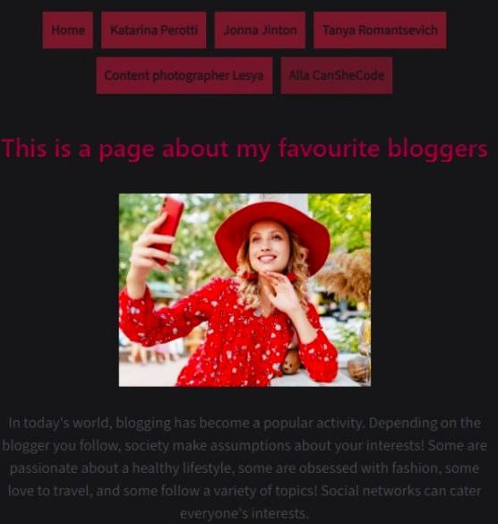

<!-- PROJECT LOGO -->

## Project Title

 <h3 align="center">My final project of React</h3>

  

 

### Built With

* HTML/CSS
* Bootstrap
* JavaScript
* GSAP
* React

<!-- ABOUT THE PROJECT -->

### About The Project

This is my final project after completing the React course. In this project, I decided to talk about my favorite bloggers, since this is very relevant now - people are increasingly going online. I talked about five bloggers. These are completely different blogs - a blog of an IT specialist, a content photographer, a culinary blog, a blog about Italy and Sweden.These are very different people, but they have one thing in common - each of them is trying to do the World has become a better place in its own way!

In this project I used API and Hooks:
* useState()
* useEffect()
* useRef()

Use the `BLANK_README.md` to get started.

<!-- GETTING STARTED -->
## Getting Started

This is an example of how you may give instructions on setting up your project locally.
To get a local copy up and running follow these simple example steps.

### Installation

_Below is an example of how you can instruct your audience on installing and setting up your app. This template doesn't rely on any external dependencies or services._

1. Clone the repo at [https://github.com/OksanaOxana/finalProjectreact](https://github.com/OksanaOxana/finalProjectreact)
2. In the terminal you need to paste the copied link to the project
3. Next, enter the cloned folder and open the code

<!-- CONTACT -->
## Contact

If you have any comments on my project, here are my contacts:

[Whatsapp](https://wa.me/+375299779119)

[Telegram](https://t.me/OxanaAksana)

[oxi_butylova@mail.ru](https://oxi_butylova@mail.ru)

Project Link: [https://github.com/OksanaOxana/finalProjectreact](https://github.com/OksanaOxana/finalProjectreact)
